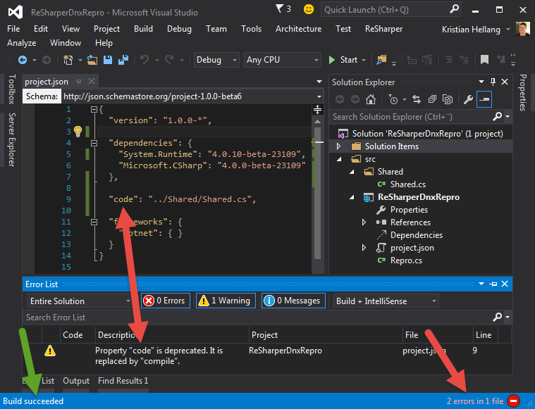
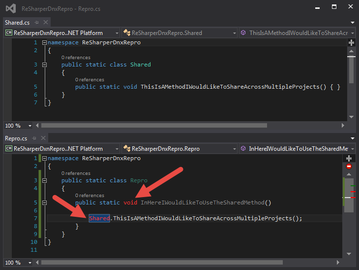

# ReSharperDnxRepro

This project shows that R# doesn't fully understand the `code`/`compile` properties of **project.json**.

Here are some screenshots:

This screenshot shows that the project built successfully using the `code` property, but there's a warning that `code` is deprecated and should be replaced with `compile`.
It also shows that R# solution-wide analysis currently yields 2 errors. I've tried switching between `code` and `compile`, restarting VS, suspending/unsuspending R#... Won't go away.

This screenshot shows the actually errors that R# suggests, even though the solution builds successfully. If I suspend R#, they go away.
I've actually managed to reproduce these errors while using both `code` and `compile`.

## Sponsors

[Entity Framework Extensions](https://entityframework-extensions.net/?utm_source=khellang&utm_medium=ReSharperDnxRepro) and [Dapper Plus](https://dapper-plus.net/?utm_source=khellang&utm_medium=ReSharperDnxRepro) are major sponsors and proud to contribute to the development of ReSharperDnxRepro.

